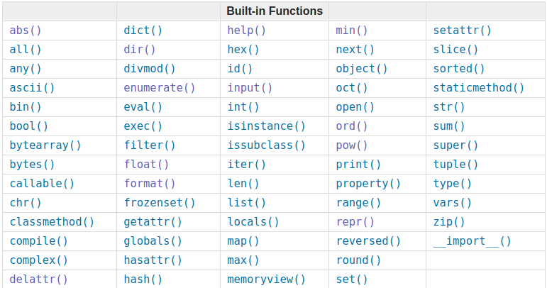

[Built-in Functions](https://docs.python.org/3/library/functions.html#format)
====================
 
			
	
mathematics
------------
- abs(x)
    - Return the absolute value of a number.
- divmod(a, b)
    - Take two (non complex) numbers as arguments and return a pair of numbers consisting of their quotient and remainder when using integer division.
- pow(x,y)
    - Return x to the power y; if z is present, return x to the power y, modulo z.
- max()
    - Return the largest item in an iterable or the largest of two or more arguments.
- min()
- sum()
    
convert
-------
- bin(x)
    - Convert an integer number to a binary string prefixed with “0b”.
- oct(x)
    - Convert an integer number to an octal string prefixed with “0o”.
- hex(x)
    - Convert an integer number to a lowercase hexadecimal string prefixed with “0x”.
- round(number, n-digits)
    - Return number rounded to n-digits precision after the decimal point.
- format()
    - Convert a value to a “formatted” representation
- chr(i)
- ord(c)

data types
----------------
- bool([x])
    - Return a Boolean value
- int()
    - Return an integer object constructed from a number or string x, or return 0 if no arguments are given.
- float()
- complex()
    - Return a complex number with the value
- str()
    - Return a str version of object.
- list()
    - literable
- tuple()
- range()
- bytes()
- bytearray()
- set()
- frozenset()	
- dict()
- iter()
- object()
- open(file, mode='r', buffering=-1, encoding=None, errors=None, newline=None, closefd=True, opener=None)

show information
----------------
- help()
- print()
- input()
- globals()
    - Return a dictionary representing the current global symbol table.
- locals()
    - Update and return a dictionary representing the current local symbol table.

methods for object
------------------
- hasattr()
- delattr()
- getattr()
- setattr()
- hash()
- help()
- dir()
    - Without arguments, return the list of names in the current local scope. With an argument, attempt to return a list of valid attributes for that object.
- len(s)
- type()
    - With one argument, return the type of an object.
- isinstance(object, classinfo)
- issubclass(class, classinfo)
- ascii()
- callable()
- id()
    - Return the “identity” of an object.
- vars()
    - Return the \_\_dict__ attribute for a module, class, instance, or any other object with a \_\_dict__ attribute.

methods for iterable
--------------------
- all()
- any()
- max()
- min()
- sum()
- enumerate()
- sorted()
- filter()
- zip()
- map()
- reversed(seq)
- slice()

methods for iterator
--------------------
- next()

Unknown
-------
- compile()
- eval()
- exec()
- property()
- memoryview()
- repr()
- staticmethod()			
- super()
- classmethod()	